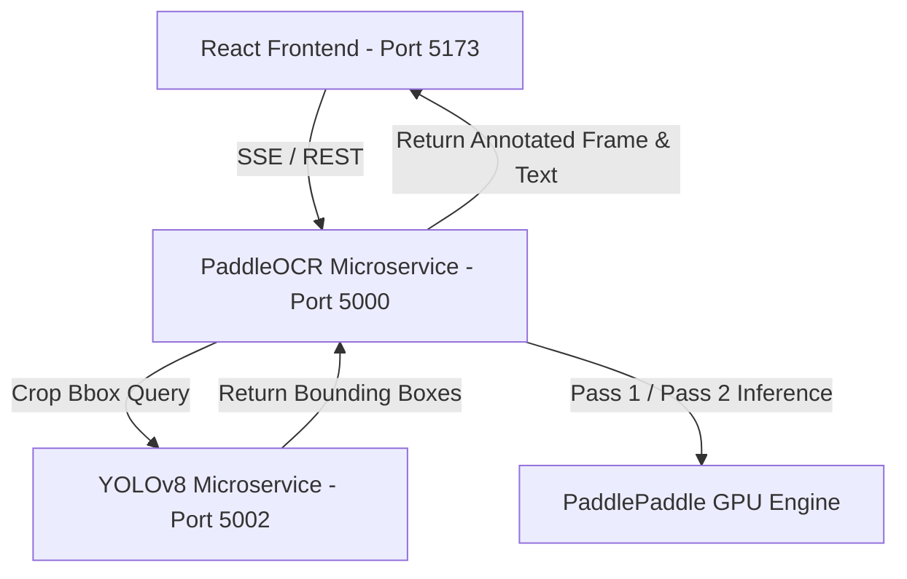

# 🚄 VandeBharat Railway Inspection: New OCR System Implementation Doc

This document provides a comprehensive technical overview and mapping of the architectural upgrades engineered to integrate the **New GPU-Accelerated OCR & Train Number Detection System** inside the `POC` codebase.

---

## 🏛️ 1. Architecture Overview: Split-Process GPU Microservices

To resolve Windows CUDA DLL loader conflicts (`0xC0000005` access violations) and optimize memory utilization on your **NVIDIA GeForce RTX 4050 GPU**, we decoupled PyTorch-YOLO and PaddlePaddle-OCR into isolated, lightweight microservices communicating over local loopback HTTP.



### 🛰️ The Port Matrix
* **Port `8000` (FastAPI backend)**: General REST APIs, static uploads, and defect database management.
* **Port `5002` (YOLO Microservice)**: Hosts both `best.pt` (Defects) and `train_num_detector.pt` (Train Number boxes) concurrently on the GPU using PyTorch CUDA.
* **Port `5000` (OCR Microservice)**: Hosts the state-of-the-art PaddleX 3.0/PaddleOCR v5 engine on PaddlePaddle-GPU.

---

## 🧠 2. Deep Dive: New OCR Pipeline Features

### 🔲 A. Dynamic 15% Box Padding
To prevent characters from being cut off near the edges of a tight YOLO bounding box, we replaced static pixel padding with dynamic padding scaled to **15% of the bounding box width and height**:
```python
box_w = x2 - x1
box_h = y2 - y1
pad_w = int(box_w * 0.15)
pad_h = int(box_h * 0.15)
```

### ⚡ B. Double-Pass Self-Healing Pipeline
* **Pass 1 (Raw Color BGR)**: Runs OCR directly on the raw BGR cropped image. This preserves sub-pixel chromatic boundaries and natural contrast, which are critical for high-resolution scene text.
* **Pass 2 (Preprocessed Retry)**: If Pass 1 yields no results, the system self-heals by converting the crop to grayscale, applying CLAHE (contrast enhancement), and sharpening it with a 2D Laplace filter before retrying.

### 🎯 C. Strict 5-6 Digit Regex Validation
To filter out background code patterns (such as bogie serial lettering, paint logos, or iron textures), all matched texts are verified against a strict Indian Railways numerical expression:
```python
# train_number_filter.py
TRAIN_NUMBER_PATTERN = re.compile(r'^\d{5,6}$')
```
Only candidate strings composed **strictly of digits** and of length **exactly 5 or 6** are accepted as valid train numbers (e.g. `14630`, `22436`).

---

## 📂 3. Files & Changes Map

### 1. `POC/package.json`
* **Changes**: Re-mapped unified launcher targets to run isolated virtual environments concurrently.
* **Launch Script**: `npm run start`

### 2. `POC/backend/OCR/server.py`
* **Changes**: 
  * Acts as a fast HTTP gateway.
  * Connects to port `5002` (YOLO) to gather coordinates.
  * Performs **case-insensitive `'Boogie'` label matching** to select the target cropping box.
  * Implements BGR offset rendering to map cropped OCR boxes back onto the full high-res image.
  * Draws custom **Neon Green** borders on YOLO crops and **Neon Yellow** text on OCR matches.

### 3. `POC/backend/OCR/src/ocr/ocr_engine.py`
* **Changes**: 
  * Integrated **Windows Dynamic DLL Injector Engine** (`os.add_dll_directory()`) to load CUDA/cuDNN packages cleanly from Python `site-packages`.
  * Resolved the **PaddleX v3.0 Dictionary format mismatch** by implementing a dual-format parser matching both legacy lists and PaddleX high-level dictionaries containing `rec_texts`, `rec_scores`, and `rec_polys` keys.

### 4. `POC/backend/OCR/src/filtering/train_number_filter.py`
* **Changes**: Replaced legacy character length filters with strict digit validation regex `^\d{5,6}$` and an adaptive `0.4` confidence threshold.

### 5. `POC/backend/YOLO/server.py`
* **Changes**: Pre-warms both `best.pt` and `train_num_detector.pt` entirely on the GPU (`cuda:0`). Returns structural JSON: `{"boxes": [...], "frame_size": [w, h]}` containing exact label strings.

### 6. `POC/ui/src/components/OCRPanel.jsx`
* **Changes**:
  * Integrates the base64 annotated image payload returned by the OCR backend.
  * Embeds an **Interactive Full-Screen Zoom Modal** with an animated backdrop filter (`backdrop-blur-md`). Clicking the live preview streams the annotated video frames onto a large high-fidelity canvas in real-time.

---

## 🚀 4. How to Run the POC System

To start the decoupled microservices in parallel, navigate to the POC root folder and run:
```bash
cd e:/PROJECTS/VandeBharat/POC
npm run start
```

This starts all four microservices (Main Backend, YOLO, OCR, and React UI) simultaneously with color-coded terminal trace logs so you can watch coordinate extraction and text parsing live!
